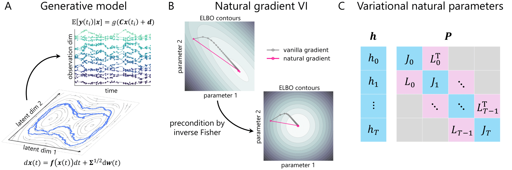

# 🎶SING: SDE Inference via Natural Gradients🎶

This repository implements the SING method for variational inference in latent SDE models from our paper,

**SING: SDE Inference via Natural Gradients**\
Amber Hu*, Henry Smith*, Scott W. Linderman \
(*Equal contribution)\
Advances in Neural Information Processing Systems (NeurIPS), 2025.\
[arXiv](https://arxiv.org/abs/2506.17796)\
[OpenReview](https://openreview.net/forum?id=jmnt0F21K7)

SING is a method for fast and reliable variational inference in *latent SDE models*, which are used to uncover unobserved dynamical systems from noisy data. To do this, SING leverages natural gradient variational inference, which adapts updates to the geometry of the variational distribution and prior. This leads to faster convergence and greater stability during inference than previous methods, which in turn enables more accurate parameter learning and use of flexible priors. 



This codebase features an efficient implementation of SING which is parallelized over sequence length and batch size, enabling scalable inference on large datasets. It also implements SING-GP, an extension of SING to inference and learning for latent SDE models with drift functions modeled with Gaussian process priors. This includes the [gpSLDS model](https://github.com/lindermanlab/gpslds) from Hu et al. (NeurIPS, 2024).

## Getting started

You can try out SING, without installing the package locally, by opening our neural data notebook `neural_data_gpslds.ipynb` in Google Colab [[link](https://colab.research.google.com/github/lindermanlab/sing/blob/main/demos/neural_data_gpslds.ipynb)].

For installing SING locally, we recommend using a virtual environment with Python version `>=3.9`. First, run:
```
pip install -U pip
```
Then, install JAX version `<= 0.5.3` in your virtual environment via the instructions [here](https://docs.jax.dev/en/latest/installation.html). For most use cases, we recommend installing JAX for GPUs with the command:
```
pip install -U "jax[cuda12]==0.5.3" "jaxlib==0.5.3"
```
Finally, install the package and its dependencies with either:
```
pip install -e .                # Install sing and core dependencies
pip install -e .[notebooks]     # Install with demo notebook dependencies
```

## Demo notebooks

Check out the demo notebooks in the `demos/` folder for examples of how to
- Get started on running inference with SING (`linear_gaussian.ipynb`)
- Perform inference on a system with nonlinear dynamics and non-Gaussian observations (`poisson_place_cell.ipynb`)
- Perform inference and parameter learning with SING and SING-GP (`inference_and_learning.ipynb`)
- Apply SING and SING-GP to a real neuroscience dataset (`neural_data_gpslds.ipynb`)

All source code can be found in the `sing/` folder.

## Tests

Tests for the sing codebase are written in `tests/test_sing.py`. You can run our test code with:
```
pytest tests/test_sing.py -q -s
```

## Citation

```
@article{hu2025sing,
  title={SING: SDE Inference via Natural Gradients},
  author={Hu, Amber and Smith, Henry D and Linderman, Scott},
  journal={Advances in Neural Information Processing Systems},
  year={2025}
}
```